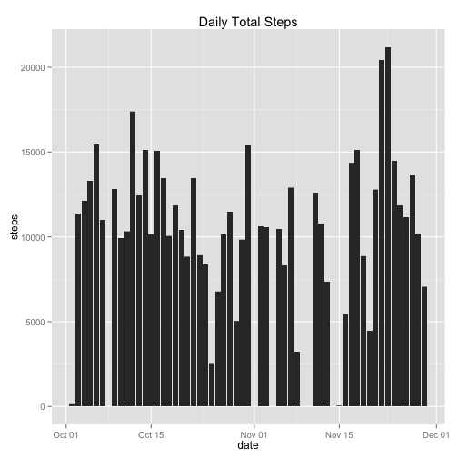
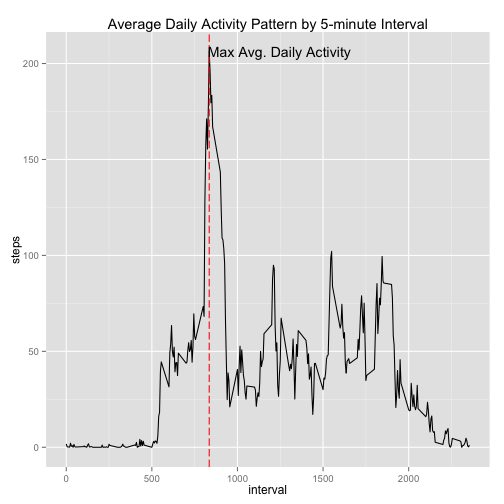
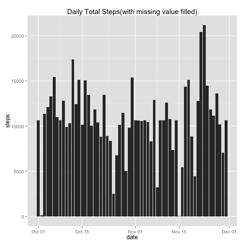
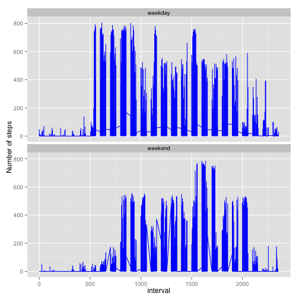

## Loading and preprocessing the data

```r
#unzip the zip file and read in the csv file
unzip("activity.zip",exdir = ".");
raw_data <- read.csv("./activity.csv");

#convert the date to date type
raw_data$date=as.Date(raw_data$date);
```

## What is mean total number of steps taken per day?
**(1)The total steps taken per day is as below:**

```r
#plot the steps per day on a bar graph
library(ggplot2)
ggplot(data=raw_data, aes(x=date, y=steps)) + geom_bar(stat="identity") + ggtitle("Daily Total Steps");
```

 

**(2)The mean and median of steps taken per day is calculated as follows:**

```r
sum <- aggregate(steps ~ date, data=raw_data, FUN=sum, na.rm=TRUE);
mean_steps <- as.integer(mean(sum$steps, na.rm=T));
median_steps <- median(sum$steps, na.rm=T);
```
=>The mean of the total number of total number of steps taken per day is 10766, the mediam number is 10765.


## What is the average daily activity pattern?
**(1)calculate tthe average number of steps taken, averaged across all days, and make a plot**

```r
average_per_interval <- aggregate(steps ~ interval, data=raw_data, FUN=mean, na.rm=TRUE);
ggplot(average_per_interval, aes(x=interval, y=steps))+
        geom_line()+
        geom_vline(xintercept=average_per_interval$interval[average_per_interval$steps==max(average_per_interval$steps)], color="red", linetype="longdash")+
        ggtitle("Average Daily Activity Pattern by 5-minute Interval")+
        annotate("text", x = 1245, y = max(average_per_interval$steps), label = "Max Avg. Daily Activity");
```

 

**(2)find which 5-minute interval, on average across all the days in the dataset, contains the maximum number of steps**

```r
interval_contains_max_steps <- average_per_interval$interval[average_per_interval$steps==max(average_per_interval$steps)];
```
=>The 835th on average across all the days in the dataset, contains the maximum number of steps.**

## Imputing missing values
**(1)calculate the number of missing value in the dataset**

```r
numOfNAs <- sum(is.na(raw_data$steps));
```
=>There are 2304 missing values in the dataset.

**(2)fill the missing value with the mean of cooresponding 5-minute interval**

```r
new_data <- raw_data;
for (i in (1:nrow(new_data))){
        if(is.na(new_data$steps[i])){
                new_data$steps[i]=floor(average_per_interval$steps[average_per_interval$interval==new_data$interval[i]]);
        }
}
```

**(3)The histogram of the total number of steps taken each day for this new data set is as below:**

```r
ggplot(data=new_data, aes(x=date, y=steps)) + geom_bar(stat="identity") + ggtitle("Daily Total Steps(with missing value filled)");
```

 

**(4)calcuate the average and mediam steps taken every day for the new data set**

```r
new_sum <- aggregate(steps ~ date, data=new_data, FUN="sum");
new_mean_steps <- as.integer(mean(new_sum$steps, na.rm=T));
new_median_steps <- as.integer(median(new_sum$steps, na.rm=T));
```
=>The mean of the total number of total number of steps taken per day for the new dataset is 10749, the mediam number is 10641.

## Are there differences in activity patterns between weekdays and weekends?
**The code and plot for the steps pattern for weekday and weenend is as follows:**

```r
#Create labels of “weekday” and “weekend” for the new dataset
weekdays=weekdays(new_data$date);
weekdays=as.factor(ifelse(weekdays %in% c("Saturday","Sunday"), "weekend", "weekday"));
new_data=cbind(new_data, weekdays);

#plot the steps pattern for weekday and weekend respectively
ggplot(new_data, aes(x=interval, y=steps))+geom_line(color="blue")+ylab("Number of steps")+facet_wrap(~weekdays, ncol=1);
```

 
